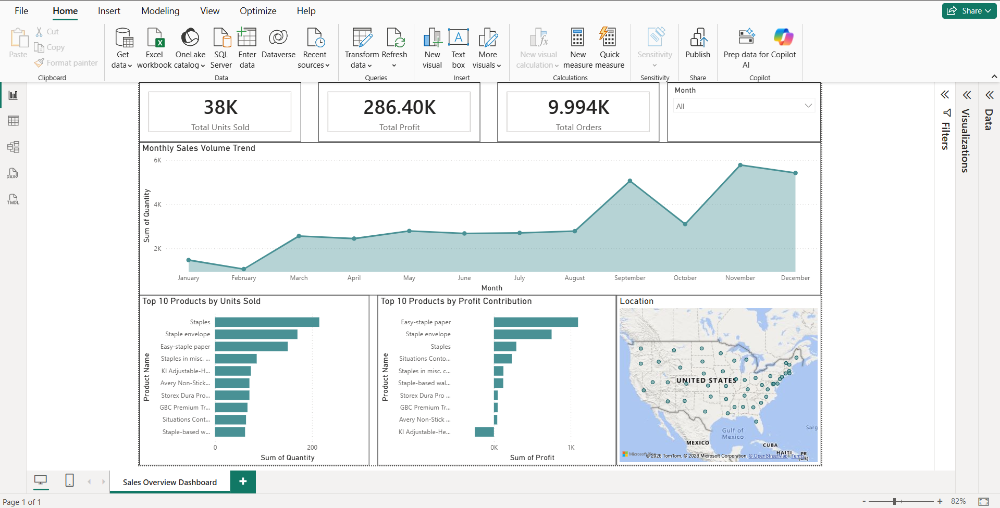

# 📊 Retail Sales Dashboard (Power BI)

## 📌 Overview

An interactive Power BI dashboard analyzing retail sales data to uncover insights into sales trends, profit distribution, and product performance.

## 🚀 Features

* KPI cards for Total Units Sold, Profit, and Orders
* Monthly sales trend analysis
* Top 10 products by quantity sold
* Top 10 products by profit contribution
* Geographic sales distribution (Map)
* Interactive slicer for filtering by month

## 🛠 Tools Used

* Power BI
* Power Query
* DAX (basic calculations)

## 📷 Dashboard Preview

## 📂 Files

* `Sales Overview Dashboard.pbix`
* `Sample - Superstore.csv`

## 💡 Insights

* Sales peak observed towards year-end months
* Certain products drive high quantity but low profit
* Geographic distribution shows concentrated sales regions

---

This project demonstrates beginner-level business intelligence and data visualization skills using Power BI.
